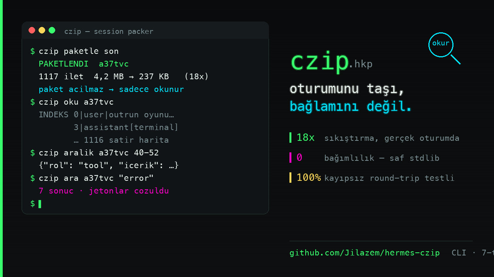

# czip — oturumunu taşı, bağlamını değil

Uzun bir Hermes sohbetini yeni oturuma taşıdığında tüm geçmiş bağlama
geri döner; 4 MB'lık oturum = 4 MB'lık token faturası.
**czip oturumu AI-okur bir pakete (HKP1) sıkıştırır ve yeni oturum o
paketi asla açmaz** — tek satırlık indeks haritasına bakar, yalnız
ihtiyacı olan mesaj aralığını okur.

```
$ czip paketle son
PAKETLENDI: a37tvc | 1117 ilet | 4,2 MB → 237 KB (18x)
```



## v3 — okuma maliyeti (2026-09-20)

Asıl darboğaz sıkıştırma oranı değilmiş: **paket dosyası context'e hiç
girmiyor**, maliyet yalnızca okuma çıktısı. 3421 iletlik gerçek oturumda
ölçüldü (`o200k_base`):

| Okuma yolu | Token |
|---|---|
| `czip oku` (tam indeks) | 93.417 |
| `czip harita` (RAG haritası) | **1.561** |
| + hedefli `czip ara "<sorgu>"` | +634 |

**60× ucuz.** `harita` tam dökümü değil, iş haritasını verir: rol sayıları,
araç histogramı, kullanıcı istekleri, son iletler ve arama talimatı. Okuyan
AI sonra yalnızca ihtiyacı olan aralığı `ara` → `aralik` ile çeker.

Ölçülen ama **işe yaramayan** iki fikir (denendi, veriyle elendi):

- **Kodek ayarı.** LZMA2 `pb=0 lc=4 dict=256MB` → yalnızca **%1,2** kazanç.
  bz2 %27 daha kötü. Mevcut `preset=9|EXTREME` zaten sınırda.
- **Dil değiştirme.** Aynı talimat: Türkçe 39, İngilizce 34, Çince 35 token.
  Üstelik talimat metni toplam maliyetin **%0,1'i** — çevirmek anlamsız.
  Kazanç dilde değil, **JSON töreninde**: son iletleri `A> metin` biçimine
  çevirmek %47 kazandırdı.

## v3 — tekrar ayıklama

Ölçüm: araç çıktıları paketin **%71'i**, ve bunların **%78'i birebir tekrar**
(8.571 çıktı → 1.854 benzersiz). İkinci kopyalar `[AYNI-#N]` işaretine çevrildi.

```
12.217.023 → 479.724 B   (önce 562.416)   oran 21,7x → 25,5x
```

Beş gerçek oturumda: **39,8 MB → 1,44 MB** (15–35x), 2.590 tekrar ayıklandı.

## v3 — birleştirme (`czip birlestir`)

Aynı işi yapan oturumları tespit edip **tek pakete** alır, istenirse
kaynakları pasife alır (kapat + arşivle; ileti silinmez, `czip gerial` ile
geri alınır).

Kararı **Jev** verir ve farkı gerçekten yapar: yerel benzerlik iki ayrı dava
dosyasını 0,75 ile birleştirmeye kalktı, **Jev 0,13 verip reddetti**; gerçek
kopyayı 0,97 ile onayladı. Zamanlanmış görev kalıpları ayıklanır (41 yanlış
eşleşme → 20).

```
czip birlestir              # salt-okunur aday taraması
czip birlestir oto --jev    # birleştir + kaynakları pasife al
czip gerial <dosya>         # geri al
```

`czip paketle` ayrıca paketledikten sonra "bu işi yapan başka oturum da var"
uyarısı verir (kararı yine Jev).

## Rakamlar (gerçek oturumlarda, kanıtlı)

| Oturum | Ham | Paket | Oran |
|---|---|---|---|
| Oyun geliştirme (1117 ilet, 31 uzun araç çıktısı) | 4,27 MB | 237 KB | **18,0x** |
| Kod / araştırma (210 ilet) | 997 KB | 119 KB | **8,4x** |
| Yeni oturumun bağlama girişi | 4,27 MB yerine | **~40 KB** indeks + son iletler | |

## Neden "paket açılmaz"?

Geleneksel kompaksiyon ya geçmişin tamamını yeni oturuma yazar (pahalı)
ya da özetler (bilgi kaybı). czip ikisini de yapmaz: **harita + isteğe
bağlı aralık** modeliyle yeni oturum 1117 iletin her birini tek satırda
görür; ayrıntı gereken mesajı numarasından çeker. Sözlük jetonları
(`␟3␞`) normal metne benzemez — çakışma yok, geri dönüş birebir
(round-trip testi: 210/210 ilet bit-bit).

## Kurulum

```bash
git clone https://github.com/Jilazem/hermes-czip && cd hermes-czip
./install.sh
```

Kurulum: `czip` CLI (`~/.local/bin`) + Hermes plugin'i (`/czip`,
`/cunzip` slash komutları) + skill köprüsü + 7 araçlık MCP sunucusu.
Hermes'i yeniden başlattıktan sonra yeni oturumlarda `/czip` gerçek
slash komut olarak görünür.

## Komutlar

```
czip paketle <session_id|son|en-uzun> [--eksiksiz] [--jev]   → paket + 6 haneli ID
czip oku <id|son>            → PAKETİ AÇMADAN: indeks + son iletler + durum
czip aralik <id|son> <bas-bit>  → seçili aralık tam metin (jetonlar çözülü)
czip ara <id|son> "sorgu"    → paket içi arama, ilgili mesaj i'lerini bul
czip listele                 → kayıtlı paketler: id | tarih | başlık
```

Yeni oturumda taşıma akışı:

```
czip oku a37tvc          # harita: hangi mesajda ne var
czip aralik a37tvc 1040-1060   # sadece gereken kısım
```

## Özellikler

- **Sözselleştirme** — tekrarlayan bloklar sözlük jetonuna iner, ham
  tekrar pakete girmez (18x'in sırrı).
- **Kayıpsız mod** — `--eksiksiz`: her bayt geri döner (8,4x).
- **Durum tespiti** — `oku` çıktısı `kullanici_yaniti_bekliyor` ve son
  iletin rolüyle "kaldığın yer"i bildirir; yeni oturum aynı yerden devam eder.
- **Gizlilik** — `state.db` daima READ-ONLY URI ile okunur; paket
  yalnızca `~/.hermes/session-packs` içine yazılır, hiçbir yere
  dışarıya gitmez, silme/bozma yetkisi yoktur.
- **Opsiyonel Jev kapısı** — `--jev`: 1200 B üstü araç çıktılarının
  "gerekiyor mu?" kararını harici LLM'e (typesafe.ai System-One) toplu
  sorar; hata ipucu içeren çıktılar asla sorgulanmaz. **Varsayılan
  kapalıdır**, örnek içerik dışarı gider — açık bayrak + API anahtarı
  gerektirir, ağ hatasında sessizce statik davranışa döner.

## Bileşenler

| Dosya | Rol |
|---|---|
| `hkp.py` | **motor** — saf stdlib (Python 3.9+, 0 bağımlılık): paketle/oku/ara, CLI, state.db RO okuyucu |
| `czip` | terminal girişi (tek satır sarmalayıcı) |
| `plugin/` | Hermes plugin'i — `/czip`, `/cunzip` slash komutları |
| `mcp_server.py` | 7 araçlık MCP sunucusu (sikistir/iceri_ac/kilavuz/mesajlar/...) |
| `skills/` | skill köprüsü — komut geçmişi eski süreçte bile çalışır |
| `scripts/kapak.py` | bu README kapağını üreten Pillow betiği |
| `tests/` | sentetik round-trip + CLI + aralık testleri (4/4) |

## Format: HKP1

```
"HKP1" | meta_len (4B BE) | veri_len (4B BE) | LZMA-9e(meta) | LZMA-9e(gövde)
```

Meta: başlık, sözlük, sayaçlar, format sürümü, paketleme bilgisi.
Gövde: mesaj kayıt listesi (rol, içerik, araç çağrıları, reasoning,
zaman damgası) — jetonlar çözülerek okunur.

## Test

```bash
python3 tests/test_roundtrip.py   # 4/4: paketle→oku→aralik + istatistik
```

## Sınırlar

- `akilli` mod araç çıktılarını 2000+2000 B baş/son dilimine indirger
  (bildirilir); birebir arşiv gerekiyorsa `--eksiksiz`.
- Paket dosyaları düz metin LZMA'dır — şifreleme sağlamaz; hassas
  içerikli oturum paketlerini disk erişimi olan herkese açık tutma.
- state.db tablo şeması Hermes sürümüne göre değişebilir; motor
  PRAGMA ile eksik kolonları otomatik atlar.
- `--jev` harici servistir (varsayılan kapalı); KVKK/veri politikası
  gerektiren işlerde kullanma.

## Lisans

MIT

## Lisans

- **Bireysel / ticari olmayan kullanım: ücretsiz ve özgür.**
- **Ticari kullanım: ayrı lisans gerektirir.** Ayrıntı: [LICENSE](LICENSE)

2026-09-20 öncesi sürümler MIT altında yayımlanmıştı; o sürümlerin MIT
hakları saklıdır.
