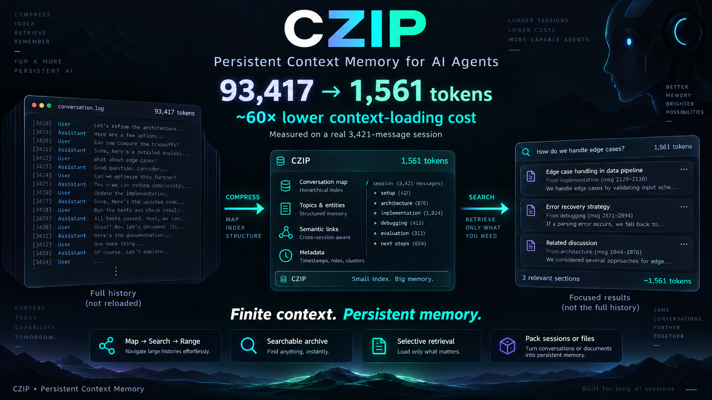

# czip — infinite context, without an infinite context window

> 🌍 English (primary) · [Türkçe](README_tr.md)

When you carry a long agent session into a new chat, the entire history
reloads into context. A 4 MB session = a 4 MB token bill.

**czip compresses an agent's full history into a persistent, searchable
pack (HKP1) — and the new session never unpacks it.** It loads a
~1,500-token map, then retrieves only the message ranges it actually
needs.



## Headline

> **93,417 → 1,561 tokens. ~60× lower context-loading cost.**
> Measured on a real 3,421-message working session (tiktoken `o200k_base`).

czip does **not** make the model's native context window infinite.
It keeps long history persistent and searchable, and retrieves only the
relevant parts when needed — *practically unbounded retrievable
history.*

**Finite context. Persistent memory.**

## v3 — the read cost was the real bottleneck

Compression ratio turned out to be the wrong metric: the pack file never
enters context at all. The cost is what the reading agent *pulls out*.
Measured on a real 3,421-message session:

| Read path | Tokens |
|---|---|
| `czip read` (full index) | 93,417 |
| `czip map` (RAG map) | **1,561** |
| + targeted `czip search "<query>"` | +634 |

**60× cheaper.** `map` does not dump the transcript — it returns a work
map: role counts, tool histogram, user requests, recent messages, and a
search instruction. The reading agent then pulls exact ranges on demand:
`search` → `range`.

Two ideas were measured and **rejected with data**:

- **Codec tuning.** LZMA2 `pb=0 lc=4 dict=256MB` gained only **1.2%**.
  bz2 was 27% worse. The current `preset=9|EXTREME` is already at the
  limit.
- **Instruction language.** Same instruction: Turkish 39 tokens, English
  34, Chinese 35 — and the instruction text is **0.1%** of total cost.
  The win is not in language, it is in **JSON ceremony**: rendering
  recent messages as `A> text` instead of JSON objects gained 47%.

## v3 — duplicate elimination

Tool outputs are **71%** of a typical pack, and **78% of them are exact
duplicates** (8,571 outputs → 1,854 unique). Second copies are replaced
with `[SAME-#N]` markers.

```
12,217,023 → 479,724 B   (previously 562,416)   ratio 21.7x → 25.5x
```

Across five real sessions: **39.8 MB → 1.44 MB** (15–35×), 2,590
duplicates eliminated.

## v3 — merging (`czip merge`)

Detects sessions doing the same job and consolidates them into **one
pack**; optionally archives the sources (close + archive; messages are
never deleted, `czip undo` restores them).

The decision is made by the **decision gate** — and it actually matters:
local similarity wanted to merge two unrelated case files at 0.75, the
gate scored it 0.13 and rejected it; a true copy was approved at 0.97.
Scheduled-task boilerplate is filtered out (41 false matches → 20).

```
czip merge               # read-only candidate scan
czip merge auto --laya   # merge + archive sources
czip undo <file>         # restore
```

`czip pack` also warns after packing when "another session did this job
too" (the decision again belongs to the gate).

## v4 — the decision gate went local: Jev → Laya

The gate used to be **Jev** (typesafe.ai System-One, a cloud API). It sent
the session title, recent user messages and tool-output samples out, so
it was **switched off on 2026-09-21** for privacy. Since 2026-09-23 the
default engine is **Laya** ([laya-mlx](https://github.com/mizorewww/laya-mlx)),
running on your own machine: no API key, nothing leaves the machine.

| | Laya (default) | Jev (legacy) |
|---|---|---|
| Where it runs | local (`laya_kapi.py` worker, model loaded once) | cloud API |
| Delete threshold | **0.15** (more protective — Laya scores are context-sensitive) | 0.30 |
| Keep threshold | 0.55 | 0.55 |
| Needs | laya-mlx venv (`CZIP_LAYA_PY`) | `TYPESAFE_API_KEY` |

- Turkish text is first translated to English by a local model
  (node1 / Qwen, `LAYA_NODE1_URL`) because Laya is weak in Turkish.
  Translations that swallow content (`"..."`) are rejected — measured
  on 2026-09-24, that bug silently deleted outputs Laya would keep at 0.73.
  Turn translation off with `CZIP_LAYA_CEVIRI=0`.
- If Laya is unavailable the gate is **skipped** and static slicing is
  used. Cloud fallback to Jev happens **only** if you enable it:
  `czip settings cloud on` (off by default).
- Engine: `czip settings engine laya|jev` or `CZIP_KARAR_MOTORU`.
- `--laya` turns the gate on; the old `--jev` flag still works.

## v4 — Claude Code & Claude Desktop

Claude Code sessions (also the ones started from Claude Desktop) live in
`~/.claude/projects/<project>/<session>.jsonl`, not in Hermes' `state.db`.
czip now reads them directly:

```
czip cc                  # list recent Claude Code sessions
czip pack cc:last        # pack the newest one
czip pack cc:<uuid>      # or a specific one (prefix is enough)
czip merge <hermes-id> cc:<uuid>   # one pack across Hermes + Claude
```

`./install.sh --claude` registers the MCP server in Claude Desktop
(`claude_desktop_config.json`, backed up first, other servers untouched)
and in Claude Code (`claude mcp add`), and installs the English skill.
New MCP tools: `claude_oturumlari` (list) and `claude_oturum_paketle`
(pack).

## v5 — autopilot: steer, guard, remember, clean

czip no longer waits to be called. In Claude Code / Claude Desktop four
hooks run it for you (`./install.sh --claude`), each silent unless it has
something worth saying:

| When | What czip does | Cost in context |
|---|---|---|
| **Session start** | *Brief*: what was done in this project lately + the **direction card** of the last pack | ~300–700 tokens, once |
| **Every prompt** | *Guard*: reads the **real** context size (last `usage` in the transcript). Crossing a tier (50/75/90 %, or `kalan_token` left) packs the session losslessly and tells the model not to bloat context (grep instead of full reads, head/tail on logs, `czip ara` instead of re-reading). At 90 %: suggest `/compact`. | 0 below threshold; ~120 tokens once per tier |
| **Every prompt** | *Recall* (RAG): searches all past packs for this request and injects at most 3 one-line hits — only if they pass the **relevance gate** (≥ half the query words in one message, Turkish letters folded). Never repeats a hit in the same session, never recalls the session's own packs. | 0 when irrelevant; ≤ ~250 tokens |
| **Before compaction** | Packs the whole session first; after compaction the new context gets `[CZIP BAGLANTISI]` + the pack id, so nothing the summary dropped is lost | ~150 tokens |

**Direction card** (`czip yon <id>`) is the decision mechanism that steers
the model. It is extracted from every pack without an LLM: goal, last request,
**decisions not to break** ("because / instead / never …" lines, taken only
from end-of-turn replies, not narration), **open tasks**, last error, files
touched, a **single next step** (unanswered request → interrupted turn →
error → open task), and a verify-on-disk rule. With `--laya` the local Laya
gate additionally filters stale lines.

**Journal** (`czip gunluk`): one line per pack (date, project, id, next step)
— the cheap answer to "what did I do?". Every pack is also added to the
full-text store automatically.

**Weekly cleanup** (`czip temizle`): dry run by default; `--apply` / the
autopilot (every 7 days, in the background) moves junk to a **trash**
folder, never deleting directly:

- `yenisi_var` — an older pack of the same session whose user/assistant
  messages are ≥ 95 % contained in a newer pack. Its short id is
  **redirected** to the newer pack, so old ids keep working. A lossless
  (`--full`) pack is never replaced by a trimmed one.
- `ayni_icerik` — byte-identical packs · `hayalet` — ≤ 2 messages, < 4 KB,
  > 7 days old · `eski_yedek` — `.bak/.yedek` copies of czip's own files
  older than 14 days (the newest 2 per file are kept) · `buyuk_log` — logs
  over 2 MB trimmed to the last 512 KB.
- Trash is emptied after 30 days; `czip temizle geri` restores the last run.

All of it is switchable: `czip settings guard|recall|brief|cleanup on|off`,
`czip settings ctx 1000000` for 1M-context models.

The MCP server no longer needs `pip install mcp`: without the package it
falls back to a built-in stdlib JSON-RPC server with the same 18 tools
(`yon_karti`, `hatirla`, `hafiza_brifing`, `temizlik` are new).

## Numbers (from real sessions, evidence-backed)

| Session | Raw | Pack | Ratio |
|---|---|---|---|
| Game dev (1,117 msgs, 31 long tool outputs) | 4.27 MB | 237 KB | **18.0×** |
| Code / research (210 msgs) | 997 KB | 119 KB | **8.4×** |
| New session's context entry | instead of 4.27 MB | **~40 KB** index + recent msgs | |

## Why never unpack?

Traditional compaction either rewrites the whole history into the new
session (expensive) or summarizes it (lossy). czip does neither: with
the **map + on-demand range** model, the new session sees every one of
1,117 messages as a single index line and fetches any message by number.
Dictionary tokens (`␟3␞`) look nothing like natural text — no collision
risk — and the round-trip is bit-exact (test suite: 210/210 messages,
bit-for-bit).

## Install

```bash
git clone https://github.com/Jilazem/Czip && cd Czip
./install.sh
```

Installs: `czip` CLI (`~/.local/bin`) + Hermes plugin (`/czip`,
`/cunzip`, `/cmap`, `/csearch` slash commands) + skill bridge + an
MCP server. After restarting Hermes, the slash commands appear
as real commands in new sessions.

For Claude Desktop / Claude Code:

```bash
./install.sh --claude    # MCP (no pip needed) + skill + autopilot hooks
```

## Commands

English aliases work everywhere (`pack` = Turkish `paketle`, etc.);
Turkish remains the native naming:

```
czip pack <session_id|last|longest|FILE|cc:last> [--full] [--laya]  → pack + 6-char id
czip read <id|last>           → WITHOUT UNPACKING: index + recent + status
czip map <id|last>            → RAG map (~1.5k tokens; the cheap read)
czip search <id|last> "query" → search inside a pack, find message indices
czip range <id|last> <a-b>    → exact messages, tokens resolved
czip around <id|last> <i> [--n=3] → message i with n neighbours each side
czip cc                       → Claude Code / Desktop sessions
czip merge [auto|<id1> <id2>] [--laya] [--days=7]
czip undo [<file>]            → restore archived sessions
czip list                     → registered packs: id | date | title
```

Carry-over flow in a new session:

```
czip map a37tvc               # which messages hold what
czip search a37tvc "edge case"
czip around a37tvc 1047       # the hit plus 3 messages each side
czip range a37tvc 1040-1060   # only the part you need
```

## Features

- **Tokenization** — repeated blocks collapse into dictionary tokens;
  raw duplication never enters the pack (the secret behind 18×).
- **Lossless mode** — `--full`: every byte comes back (8.4×).
- **State detection** — `read` reports `awaiting_user_reply` plus the
  last message's role, so the new session resumes exactly where the old
  one stopped.
- **Privacy** — `state.db` is always opened via a READ-ONLY URI; packs
  are written only under `~/.hermes/session-packs`; nothing leaves the
  machine; the engine has no delete/corrupt capability.
- **Optional decision gate** — `--laya` asks the local Laya model in
  batches whether tool outputs above 1,200 B are needed; outputs
  containing error hints are never questioned. Off by default; falls
  back silently to static slicing when Laya is not installed.
- **Token economy line** — `czip map` ends with
  `COST map~Nk tok vs full~Mk tok -> X% saved`, so the saving is visible.

## Components

| File | Role |
|---|---|
| `hkp.py` | **engine** — pure stdlib (Python 3.9+, 0 deps): pack/read/search, CLI, state.db RO reader |
| `czip` | terminal entry point (one-line wrapper) |
| `plugin/` | Hermes plugin — `/czip`, `/cunzip` slash commands |
| `mcp_server.py` | MCP server (compress/open/guide/messages/memory/Claude sessions) |
| `karar.py` | decision-gate engine selector (Laya local / Jev cloud) |
| `laya_kapi.py` | persistent Laya worker (runs inside the laya-mlx venv) |
| `ccd_dokum.py` | Claude Code / Desktop transcript `.jsonl` → czip messages |
| `scripts/claude_kur.py` | registers the MCP server in Claude Desktop (+ `--hooks` for Claude Code) |
| `claude_hook.py` / `hooks/hooks.json` | autopilot hooks: brief, guard, recall, pre-compact pack |
| `yon.py` | direction card: decisions, open tasks, single next step |
| `hafiza.py` | journal + session brief + relevance-gated recall |
| `temizlik.py` | weekly cleanup with trash, id redirects and undo |
| `skills/` | skill bridge — commands work even in old processes |
| `scripts/kapak.py` | Pillow script that renders the terminal cover |
| `tests/` | synthetic round-trip + CLI + range tests (4/4) |

## Format: HKP1

```
"HKP1" | meta_len (4B BE) | data_len (4B BE) | LZMA-9e(meta) | LZMA-9e(body)
```

Meta: title, dictionary, counters, format version, packing info.
Body: message record list (role, content, tool calls, reasoning,
timestamp) — resolved into readable text on demand.

## Tests

```bash
python3 tests/test_roundtrip.py          # 4/4: pack→read→range + stats
python3 -m unittest discover -s tests    # manifests + Laya gate + Claude bridge
```

## Limits

- `smart` mode truncates tool outputs to 2000+2000 B head/tail slices
  (and reports it); use `--full` for a bit-exact archive.
- Pack files are plain-text LZMA — no encryption. Do not expose packs
  from sensitive sessions to anyone with disk access.
- The `state.db` schema varies with Hermes versions; the engine skips
  missing columns via PRAGMA.
- The Jev engine is an external service (off by default, and the cloud
  fallback is off too); avoid it under data-protection policies.
  Laya needs Apple-silicon MLX (laya-mlx); elsewhere the gate is skipped.

## License

- **Individual / non-commercial use: free and open.**
- **Commercial use: separate license required.** Details: [LICENSE](LICENSE)

Versions before 2026-09-20 were released under MIT; those versions
remain MIT-licensed.
