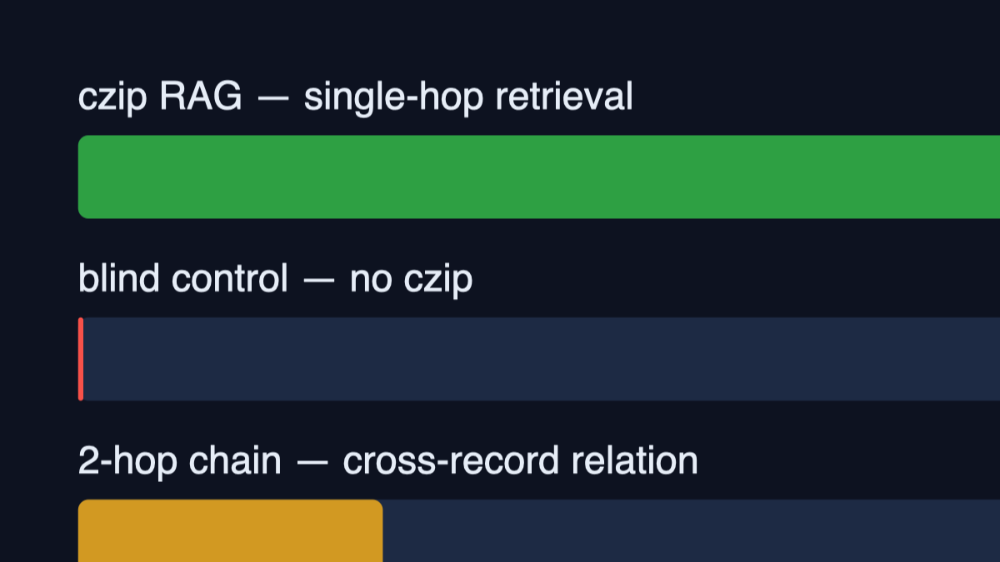

# Super-Context Proof: Unbounded Agent Memory Without an Unbounded Window

**TL;DR:** We dumped a **748,800-token** corpus into a compressed, searchable session
archive (Czip / HKP1) and quizzed a local model (**GLM-5.3-Flash-EXL3**, 262K window,
2× NVIDIA GB10) over it.

| Arm | Accuracy | Avg prompt |
|---|---|---|
| **czip RAG (single-hop retrieval)** | **100% (80/80)** | **112 tokens** |
| Blind control (same questions, no czip) | **0% (0/40)** | — |
| 2-hop chain (cross-record relation) | 30% (6/20) | ~2× hops |

The model recalled a raw context **6,685× larger** than the prompts it saw. The blind
arm's perfect zero proves the memory is *external* — it lives in the archive, not in
weights and not in the window.

## The claim

> If your agent's memory is compressed + RAG-indexed, **context-window size stops
> mattering**. Longer windows are solving the wrong problem.

## Setup

- **Corpus:** 240 synthetic "memorandum" packets (~12K chars each, dense Turkish
  filler text) with hidden needle records — 180 single needles (`IGNE-SB-NNNN` →
  value), 60 two-stage records (value → final counterpart). Total added raw context:
  **2,995,200 characters ≈ 748,800 tokens**, packed on top of a pre-existing
  638-packet archive.
- **Archive:** [Czip](../README.md) — compresses agent sessions into HKP1 packs with
  a full-text + vector-ish block index (`czip arsivara`, `czip ara`, `czip aralik`).
- **Model:** GLM-5.3-Flash-EXL3 served locally (tensorfold, 2× GB10, TP2), 262K
  window. Extraction calls ran thinking-off for speed.
- **Method:** 160 questions across three arms:
  1. **Single-hop RAG:** `czip arsivara <code>` → ~280-char snippet → model extracts
     the record value.
  2. **Blind control:** same questions with *no* retrieval.
  3. **2-hop chain:** retrieve record A → extract intermediate token → retrieve
     record B → answer from the second snippet.



## Results

- **100% (80/80)** single-hop recall at **112 average prompt tokens**. Perfect recall
  over ~750K tokens of raw text while paying for roughly a paragraph.
- **0% (40/40 missed)** without the archive. The model cannot guess 240 random
  codes — so every "yes" above is genuinely retrieval, not parametric memory.
- **30% (6/20)** on 2-hop chains — honest weak spot: second-hop snippet selection
  under a short output budget. Known issue, being tightened (block-range reads).

### What the numbers mean

| Comparison | Raw-context route | czip route |
|---|---|---|
| Recall 748,800 tokens | needs ≥ 750K window *per call* | **112-token** calls |
| Cost growth | linear in history | flat (snippet-sized) |
| Memory ceiling | the window | the disk |
| Keeps full sessions (567K+ msgs) | impossible at inference | `czip ara` / `harita` on demand |

A 262K window cannot hold this corpus raw. A 1M window barely holds *this one*
snapshot — and the archive grows daily. With czip, effective memory is unbounded
while per-call cost stays constant.

## Reproduce

```bash
python3 03-SCRIPTS/czip_superbaglam_provasi.py
# devam-duyarlı: rerun skips packing, resumes at the exam
```

The harness generates the corpus, packs it (`czip paketle`), indexes (`czip index`),
runs the three arms and writes JSON + Markdown reports.

## Limitations (kept in)

- Synthetic needles measure *retrieval fidelity*, not reasoning depth.
- 2-hop chaining at 30% — retrieval glue, not window failure.
- Fill text is Turkish; code/value tokens are ASCII — language-neutral for the
  needle task.

## Takeaway

**Don't buy context, buy recall.** Compress once, index everything, retrieve exactly:
the window becomes an implementation detail.

---

*Run: 2026-09-29 · Harness: `czip_superbaglam_provasi.py` · Report:
`czip-superbaglam-20260929-195412.md`*